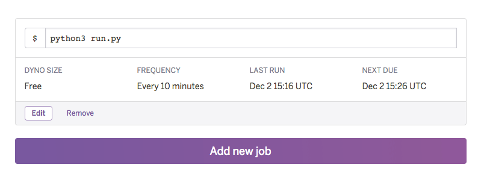

# SKAMBOT

Skambot er raskt gaffet sammen for å kunne gi oss beskjed i #skam i Slack-teamet vårt når det har kommet noe nytt på [skam.p3.no](http://skam.p3.no). Siden NRK tilsynelatende har fjernet RSS-feeden kjører vi et lite webscraping script i Python som titter på nettsiden etter noe nytt. Om tittelen i den siste posten ikke matcher den siste som er lagt i databasen, poster den en melding i Slack. Det er bare gamlinger som ser SKAM én gang i uka.

## Installere skambot

### 1. Lag en *Incoming Webhook* i Slack

Om du er admin, eller har tilgang til team-instillingene i Slack, kan du sette opp en såkalt «incoming webhook». Da får du en unik URL som kan ta i mot meldinger og poste dem i en bestemt kanal. Om du ønsker å bruke Eskild som avatar, finner du han her .

### 2. Deploy denne appen på Heroku

Skambot kan kjøres lokalt, men da må du finne ut hvordan du lagrer titlene selv (f.eks med en sqlite-database, eller en flatfil). Vi kjører skambot i skyen på Heroku. Den fungerer godt på en gratis dyno og siden scriptet kjører i maks et par sekunder, vil den ikke stjele særlig av gratistiden på kontoen.

Det kan være en fordel å sette *Runtime Selection* til Europe.

### 3. Legg til URLen i Heroku-configen, om du ikke allerede har gjort det.

eller `heroku config:add WEBHOOK_URL=https://hooks.slack.com/services/xxxxxxxxx/xxxxxxxxx/xxxxxxxxxxxxxxxxxxxxxxxx`

### 4. Sett opp Heroku Scheduler

Du finner Heroku Scheduler under *Resources* -> *Add-ons* i Heroku-dashboardet. Klikk på den for å stille inn. Vi har stilt den inn på å kjøre skriptet hvert 10ende minutt. 

### 5. Vent på at det skal skje noe på [skam.p3.no](http://skam.p3.no).

Laga med :heart: av dine venner i [Netlife Research](http://www.netliferesearch.com).

*Når man er på julebord og det kommer et nytt SKAM-klipp*
